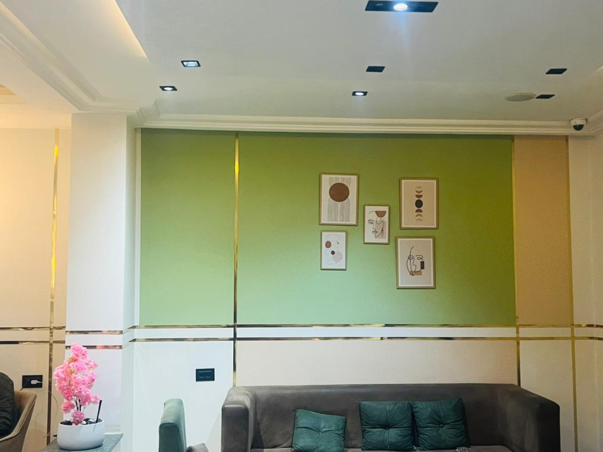

# 🎨 THE LOFT LOUNGE - FRONTEND COMPLET

## 📋 STRUCTURE DU PROJET

```
the_loft_lounge - s2/
├── index.html                      ← Page principale (1000 lignes)
├── script.js                        ← Logique JavaScript (260 lignes)
├── styles.css                       ← Styles CSS (1000+ lignes)
├── menu_complet.html               ← Menu détaillé
├── menu_additions.html             ← Additions menu
├── payment_modals.html             ← Modales paiement
├── payment_system.js               ← Système de paiement
├── payment_styles.css              ← Styles paiement
├── assets/
│   └── images/                     ← Photos du café
├── admin-dashboard.html            ← Tableau de bord admin
└── test-backend.html               ← Page de test backend
```

---

## 🎯 SECTIONS DE LA PAGE D'ACCUEIL

### 1️⃣ **NAVIGATION** (navbar.navbar)
- **Logo:** The Loft.
- **Menu:** Accueil, À Propos, Menu, Services, Galerie, Avis, Contact
- **Mobile:** Hamburger menu responsif

```html
<nav class="navbar">
  <a href="#" class="logo">The Loft<span>.</span></a>
  <ul class="nav-links" id="navLinks">
    <li><a href="#home">Accueil</a></li>
    <li><a href="#about">À Propos</a></li>
    ...
  </ul>
</nav>
```

---

### 2️⃣ **HERO SECTION** (#home)
- **Image de fond:** `assets/images/classic_bg.png`
- **Texte:** "Bienvenue au Loft Lounge"
- **CTA buttons:** 
  - Voir le Menu
  - Réserver une table

```html
<section id="home" class="hero">
  <h1>Bienvenue au <span class="highlight">Loft Lounge</span></h1>
  <button class="btn btn-primary" data-action="view-menu">Voir le Menu</button>
  <button class="btn btn-outline" data-action="book-table">Réserver</button>
</section>
```

---

### 3️⃣ **À PROPOS** (#about)
- **Texte descriptif** du café
- **3 feature cards:**
  - Café Premium
  - Cuisine Raffinée
  - Ambiance Lounge

```css
.feature-card {
  background: linear-gradient(135deg, var(--white-pure), var(--bg-sage));
  padding: 40px 20px;
  transition: all 0.4s cubic-bezier(0.165, 0.84, 0.44, 1);
}

.feature-card:hover {
  transform: translateY(-10px);
  box-shadow: 0 15px 40px rgba(212, 175, 55, 0.2);
}
```

---

### 4️⃣ **MENU** (#menu)
- **6 catégories:** 
  - Pizzas Italiennes
  - Burgers Gourmets
  - Fruits de Mer
  - Tacos & Burritos
  - Sandwichs & Paninis
  - Pâtisseries

```html
<div class="menu-grid">
  <div class="menu-item">
    <div class="menu-icon"><i class="fas fa-pizza-slice"></i></div>
    <div class="menu-details">
      <h3>Pizzas Italiennes</h3>
      <p>Pâte fine, ingrédients frais et recettes authentiques.</p>
    </div>
  </div>
  ...
</div>
```

**Lien:** "Voir la Carte Complète" → `menu_complet.html`

---

### 5️⃣ **SERVICES** (#services)
- **3 services:**
  - Wifi Gratuit
  - Café Premium
  - Ambiance Lounge

```html
<div class="service-box">
  <i class="fas fa-wifi"></i>
  <h3>Wifi Gratuit</h3>
  <p>Connexion haut débit disponible pour tous nos clients</p>
</div>
```

---

### 6️⃣ **GALERIE** (#gallery)
- **5 images** du café:
  - Intérieur - Mur Vert Sauge
  - Escalier avec Décoration Florale
  - Mur de Fleurs de Cerisier
  - Salle Principale
  - Entrée The Loft

```html
<div class="gallery-item">
  
  <div class="gallery-overlay">
    <i class="fas fa-search-plus"></i>
    <p>Espace Lounge</p>
  </div>
</div>
```

---

### 7️⃣ **TÉMOIGNAGES** (#testimonials)
- **3 avis clients:**
  - Ahmed Ben Ali (Client régulier)
  - Salma Trabelsi (Amatrice de café)
  - Karim Mansour (Entrepreneur)
- **5 étoiles** pour chaque avis

```html
<div class="testimonial-card">
  <div class="testimonial-stars">
    <i class="fas fa-star"></i> × 5
  </div>
  <p class="testimonial-text">"Un endroit magnifique..."</p>
  <div class="testimonial-author">
    <h4>Ahmed Ben Ali</h4>
    <p>Client régulier</p>
  </div>
</div>
```

---

### 8️⃣ **CONTACT** (#contact)
- **Infos de contact:**
  - Adresse: Sidi Bouzid, Tunisie
  - Téléphone: +216 58 044 359 / +216 94 840 088
  - Email: contact@theloftlounge.com
  - Horaires: 8h00 - 23h00
- **Formulaire de contact** (nom, email, message)
- **Liens sociaux:** Facebook, Instagram

```html
<form class="contact-form" id="contactForm">
  <input type="text" name="name" placeholder="Votre Nom" required>
  <input type="email" name="email" placeholder="Votre Email" required>
  <textarea name="message" placeholder="Votre Message" required></textarea>
  <button type="submit" class="btn btn-primary">Envoyer</button>
</form>
```

---

## 🎭 MODALES (DIALOGS)

### 1. Réservation (#bookingModal)
```html
<div class="modal" id="bookingModal">
  <form class="modal-form" id="bookingForm">
    <input type="text" name="name" placeholder="Nom complet" required>
    <input type="tel" name="phone" placeholder="Téléphone" required>
    <input type="date" name="date" required>
    <input type="time" name="time" required>
    <select name="guests" required>
      <option value="1">1 personne</option>
      <option value="2">2 personnes</option>
      ...
      <option value="6+">6+ personnes</option>
    </select>
    <textarea name="notes" placeholder="Demandes spéciales"></textarea>
    <button type="submit">Confirmer la Réservation</button>
  </form>
</div>
```

### 2. Menu Complet (#menuModal)
- Affichage de toutes les catégories
- Prix de chaque plat
- Boutons "Ajouter au panier"

### 3. Panier (#cartModal)
- Liste des articles
- Sous-total
- Frais de livraison
- Total

### 4. Checkout (#checkoutModal)
**3 étapes:**
1. **Infos client:** Nom, téléphone, email
2. **Livraison:** Méthode (Click & Collect ou Domicile)
3. **Paiement:** Espèces, D17, ou Carte

### 5. Confirmation (#orderConfirmModal)
- Numéro de commande
- Message de confirmation
- Temps de livraison estimé
- Bouton "Suivre ma Commande"

---

## 🎨 DESIGN & COULEURS

### Palette de couleurs
```css
:root {
    --sage-green: #8B9A7A;              /* Vert sage (principal) */
    --primary-gold: #D4AF37;            /* Or doré (accents) */
    --pink-blossom: #FFB8D1;            /* Rose fleur de cerisier */
    --white-marble: #F5F5F0;            /* Blanc marbre */
    --gray-dark: #4A4A4A;               /* Gris foncé */
    --green-carpet: #2F5D3E;            /* Vert foncé */
}
```

### Typographie
```css
--font-heading: 'Playfair Display', serif;  /* Titres élégants */
--font-body: 'Lato', sans-serif;            /* Corps de texte */
```

### Effets
- **Glass morphism** - Background transparent avec blur
- **Gradient text** - Texte avec dégradé
- **Box shadows** - Ombres élégantes
- **Transitions** - 0.4s cubic-bezier(0.165, 0.84, 0.44, 1)

---

## ⚙️ FONCTIONNALITÉS JAVASCRIPT

### 1. Animations de scroll
```javascript
const revealOnScroll = () => {
    revealElements.forEach((el) => {
        const elementTop = el.getBoundingClientRect().top;
        if (elementTop < windowHeight - elementVisible) {
            el.classList.add('active');
        }
    });
};
```

### 2. Menu mobile
```javascript
navToggle.addEventListener('click', () => {
    navLinks.classList.toggle('active');
    // Toggle icon between bars et times
});
```

### 3. Gestion des modales
```javascript
function openModal(modalId) {
    const modal = document.getElementById(modalId);
    modal.classList.add('active');
    document.body.style.overflow = 'hidden';
}

function closeModal(modalId) {
    const modal = document.getElementById(modalId);
    modal.classList.remove('active');
    document.body.style.overflow = '';
}
```

### 4. Formulaires
```javascript
const bookingForm = document.getElementById('bookingForm');
bookingForm.addEventListener('submit', (e) => {
    e.preventDefault();
    const data = Object.fromEntries(new FormData(bookingForm));
    console.log('Booking Data:', data);
    showNotification('Réservation confirmée!');
});
```

### 5. Notifications
```javascript
function showNotification(message) {
    const notification = document.getElementById('notification');
    notificationText.textContent = message;
    notification.classList.add('show');
    
    setTimeout(() => {
        notification.classList.remove('show');
    }, 4000);
}
```

---

## 📱 RESPONSIVE DESIGN

### Breakpoints
```css
/* Desktop: 1200px+ */
@media (max-width: 1200px) { }

/* Tablette: 768px - 1199px */
@media (max-width: 768px) { }

/* Mobile: < 768px */
@media (max-width: 480px) { }
```

### Ajustements mobiles
- **Navbar:** Hamburger menu
- **Hero:** Padding réduit
- **Grid:** 1 colonne
- **Buttons:** Taille augmentée
- **Text:** Taille réduite

---

## 🔗 LIER LE FRONTEND AU BACKEND

### Configuration API
```javascript
const API_URL = 'http://localhost:3000/api';

// Charger le menu depuis l'API
async function loadMenuFromAPI() {
    try {
        const response = await fetch(`${API_URL}/menu`);
        const data = await response.json();
        
        if (data.success) {
            displayMenu(data.data);
        }
    } catch (error) {
        console.error('Erreur:', error);
    }
}

// Créer une commande
async function submitOrder(orderData) {
    try {
        const response = await fetch(`${API_URL}/orders`, {
            method: 'POST',
            headers: { 'Content-Type': 'application/json' },
            body: JSON.stringify(orderData)
        });
        
        const data = await response.json();
        return data;
    } catch (error) {
        console.error('Erreur:', error);
    }
}
```

---

## 📁 FICHIERS SUPPLÉMENTAIRES

### `menu_complet.html`
- Page complète avec tous les plats
- Organisations par catégories
- Prix et descriptions

### `payment_modals.html` & `payment_styles.css`
- Modales de paiement
- Styles pour les systèmes de paiement

### `admin-dashboard.html`
- Tableau de bord administrateur
- Gestion des commandes
- Gestion des réservations

### `test-backend.html`
- Page de test pour vérifier la connexion au backend
- Formulaires de test

---

## 🚀 DÉPLOIEMENT

### Sur Netlify
1. Créer un compte: https://netlify.com
2. Déposer les fichiers
3. Publier automatiquement

### Sur GitHub Pages
```bash
git init
git add .
git commit -m "Initial commit"
git push -u origin main
```

### Localement
```bash
# Avec Live Server (VS Code)
Right-click index.html → Open with Live Server

# Ou avec Python
python -m http.server 8000
# Puis ouvrir http://localhost:8000
```

---

## 📊 STRUCTURE COMPLÈTE DE PAGE

```
┌─────────────────────────────────────┐
│  NAVBAR (sticky)                     │
├─────────────────────────────────────┤
│  HERO SECTION                        │
│  - Fond image                        │
│  - CTA buttons                       │
├─────────────────────────────────────┤
│  ABOUT SECTION                       │
│  - Description                       │
│  - 3 feature cards                   │
├─────────────────────────────────────┤
│  MENU SECTION                        │
│  - 6 catégories                      │
│  - Bouton "Voir la carte complète"   │
├─────────────────────────────────────┤
│  SERVICES SECTION                    │
│  - 3 services                        │
├─────────────────────────────────────┤
│  GALLERY SECTION                     │
│  - 5 images                          │
├─────────────────────────────────────┤
│  TESTIMONIALS SECTION                │
│  - 3 avis clients                    │
├─────────────────────────────────────┤
│  CONTACT SECTION                     │
│  - Infos                             │
│  - Formulaire                        │
├─────────────────────────────────────┤
│  FOOTER                              │
└─────────────────────────────────────┘
```

---

## 🐛 DÉPANNAGE

### Styles ne s'appliquent pas
```html
<!-- Vérifier le lien CSS -->
<link rel="stylesheet" href="styles.css">
```

### Images ne s'affichent pas
```html
<!-- Vérifier le chemin relatif -->

```

### Modales ne s'ouvrent pas
```javascript
// Vérifier que openModal est appelé avec le bon ID
openModal('bookingModal');

// Vérifier que la modale existe
<div class="modal" id="bookingModal">
```

### Backend ne répond pas
```javascript
// Vérifier que le serveur tourne
curl http://localhost:3000/health

// Vérifier l'URL de l'API
const API_URL = 'http://localhost:3000/api'; // IMPORTANT: http://, pas https://
```

---

## 📞 FICHIERS CLÉS

| Fichier | Taille | Description |
|---------|--------|-------------|
| index.html | 1000 lignes | Page principale complète |
| script.js | 260 lignes | Logique et interactions |
| styles.css | 1000+ lignes | Tous les styles |
| menu_complet.html | ? | Menu détaillé |
| payment_modals.html | ? | Modales paiement |

---

## ✅ CHECKLIST DE LANCEMENT

- [x] HTML valide et complet
- [x] CSS et styles appliqués
- [x] JavaScript fonctionnel
- [x] Responsive design testé
- [x] Modales fonctionnelles
- [x] Formulaires de contact
- [x] Galerie d'images
- [x] Navigation fluide
- [ ] Intégration backend API
- [ ] Tests en production

